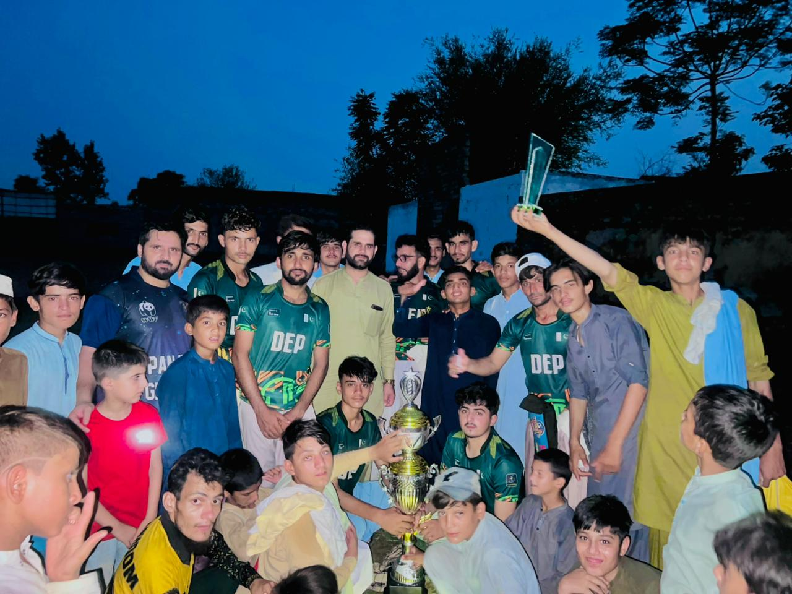
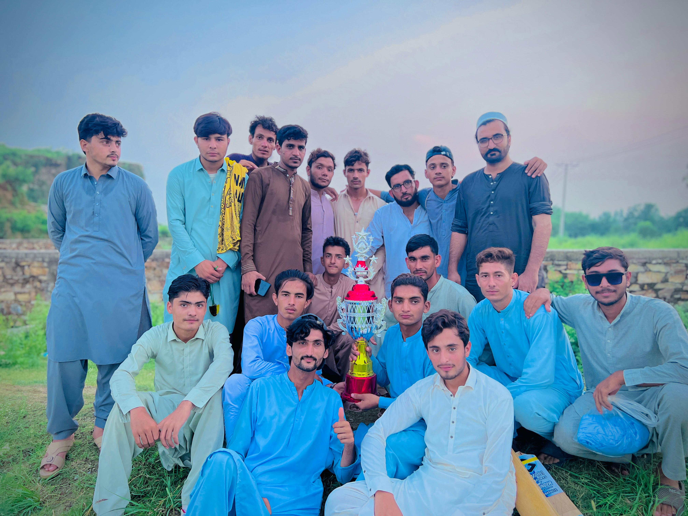

<!DOCTYPE html>
<html lang="en">
<head>
    <meta charset="UTF-8">
    <meta name="viewport" content="width=device-width, initial-scale=1.0">
    <title>Doctor 11 Panjman | Official</title>
    
</head>
<body>

<header>
    
    <h1>DOCTOR 11 PANJMAN</h1>
    
Official Cricket Team | Panjman, Swabi

</header>

<nav>
    <a href="#gallery">Achievements</a>
    <a href="#squad">Squad</a>
    <a href="#news">Announcements</a>
    <a href="#management">Management</a>
</nav>

    <h2>🏆 Achievements & Gallery</h2>
    

        

            
            
Tournament Winners 2025

        

        

            
            
Finalists - Swabi Cup

        

    

    <h2>📢 Latest Announcements</h2>
    
    

        <h3 style="color: #075e54; margin-top: 0; text-align: center;">🏏 FINAL MATCH: DOCTOR 11 vs QADRA</h3>
        
ڈاکٹر 11 پنجمن بہ مقابلہ قدرہ

        
        

            <ul style="list-style: none; padding: 0; margin: 0; color: #333; line-height: 2;">
                <li>📅 <b>Day:</b> Friday (جمعہ)</li>
                <li>⏰ <b>Time:</b> 2:30 PM (ڈھائی بجے)</li>
                <li>📍 <b>Venue:</b> Qadra Cricket Ground (قدرہ کرکٹ گراؤنڈ)</li>
            </ul>
        

        
        

            ہم اپنے معزز مہمانوں اور شائقینِ کرکٹ کا صمیمِ قلب سے خیر مقدم کرتے ہیں۔ آپ سب کی شرکت ہمارے لیے اعزاز کی بات ہوگی۔
        

        

            We warmly welcome all cricket fans and look forward to your gracious presence!
        

    

    <h2>📢 Latest Announcements</h2>
    

        <h3 style="color: #075e54; margin: 0;">🏆 Doctor 11 Enters PSL 2026!</h3>
        
We are thrilled to participate in the <b>3rd Edition of the Panjman Super League</b> as a participant and sponsor!

    

    <h2>🏏 2026 Official Squad (18 Players)</h2>
    

        
Muneer IqbalCaptain

        
Muhammad AmirPremium All-Rounder

        
Huzaifa AhmadPlayer

        
Muhammad HasnainPlayer

        
Haris IqbalPlayer

        
Behram KhanPlayer

        
Shakeel AhmadPlayer

        
Waqar KhanPlayer

        
Saqib ShahPlayer

        
AbubakarPlayer

        
ShehbazPlayer

        
Azan KhanPlayer

        
Baser KhanPlayer

        
Sohail AhmadPlayer

        
Osama KhanPlayer

        
Ihtisham KhanPlayer

    

    <h2>🤝 Team Leadership & Contact</h2>
    
    

        
        

            <h4 style="margin: 0; color: #075e54;">Dr. Tausif Ahmad</h4>
            
Team Owner

            
Founder and Lead Supporter of Doctor 11 Panjman.

        

        

            <h4 style="margin: 0; color: #075e54;">Sameer Khan</h4>
            
Media Director & Web Developer

            
Managing digital presence and SH Studio productions.

        

    

    

        <h3 style="margin-top: 0; font-size: 1.5em; letter-spacing: 1px;">📩 CONNECT WITH US</h3>
        
Official contact for Doctor 11 Panjman inquiries and SH Studio media.

        
        

            <a href="https://wa.me/923429212247" target="_blank" style="text-decoration: none; background: #25d366; color: white; padding: 12px 25px; border-radius: 50px; font-weight: bold; font-size: 0.9em; transition: 0.3s; border: 2px solid #25d366;">
                WhatsApp
            </a>
            
            <a href="mailto:asameerkhan352@gmail.com" style="text-decoration: none; background: white; color: #075e54; padding: 12px 25px; border-radius: 50px; font-weight: bold; font-size: 0.9em; transition: 0.3s; border: 2px solid white;">
                Email Team
            </a>

            <a href="https://youtube.com/@sh-studio_official?si=smcbPjsf45GtuZPy" target="_blank" style="text-decoration: none; background: #ff0000; color: white; padding: 12px 25px; border-radius: 50px; font-weight: bold; font-size: 0.9em; transition: 0.3s; border: 2px solid #ff0000;">
                SH Studio YouTube
            </a>
        

        
        

            📍 Panjman, Swabi, Khyber Pakhtunkhwa, Pakistan
        

    

    
&copy; 2026 Doctor 11 Panjman | Built by Sameer Khan

</body>
</html>
